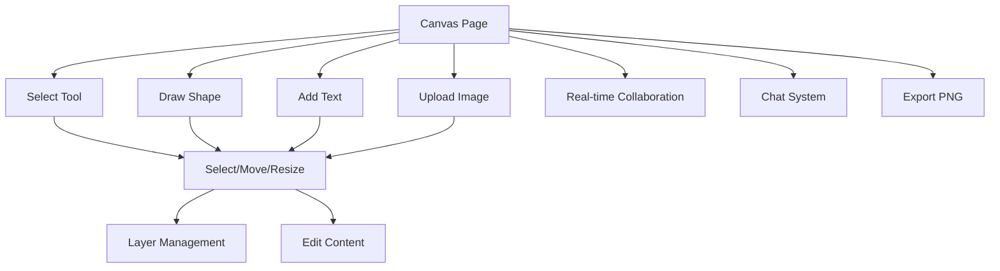

## 1. Product Overview

Whitespace is a real-time collaborative whiteboard application that enables multiple users to work together on visual projects simultaneously. Users can create, edit, and organize various elements including shapes, text, images, and freehand drawings while seeing each other's cursors and changes in real-time.

The product solves the problem of remote visual collaboration by providing an intuitive digital canvas where teams can brainstorm, plan, and visualize ideas together regardless of their physical location. It's designed for designers, project managers, educators, and any team that needs to collaborate visually in real-time.

## 2. Core Features

### 2.1 User Roles

| Role | Registration Method | Core Permissions |
|------|---------------------|------------------|
| Guest User | Auto-generated username | Full access to canvas tools, real-time collaboration |

### 2.2 Feature Module

Our collaborative whiteboard consists of the following main pages:

1. **Canvas Page**: Interactive whiteboard with drawing tools, real-time collaboration, and chat functionality.

### 2.3 Page Details

| Page Name | Module Name | Feature description |
|-----------|-------------|---------------------|
| Canvas Page | Drawing Tools | Select, pencil, rectangle, circle, text, sticky notes, and image upload tools with keyboard shortcuts |
| Canvas Page | Real-time Collaboration | Live cursor tracking, simultaneous editing, and user presence indicators |
| Canvas Page | Layer Management | Bring to front, send to back operations for element z-order control |
| Canvas Page | Chat System | Real-time messaging with colored usernames and auto-scroll functionality |
| Canvas Page | Canvas Controls | Pan, zoom, undo/redo, clear board, dark/light mode toggle |
| Canvas Page | Export Functionality | Save canvas as PNG image with compression |
| Canvas Page | User Management | Username setting and display with modal interface |
| Canvas Page | Element Editing | Double-click to edit text content with modal editor |
| Canvas Page | Selection & Resize | Click to select elements, drag to move, corner handle to resize |

## 3. Core Process

**User Flow:**
1. User lands on canvas page with auto-generated "Guest" username
2. User can immediately start drawing using toolbar tools or keyboard shortcuts
3. Other users' cursors appear in real-time with unique colors
4. Users can select, move, resize, and layer elements
5. Chat functionality allows text communication alongside visual collaboration
6. Users can export their work as PNG images
7. All changes persist and sync across all connected users

## 4. User Interface Design

### 4.1 Design Style

- **Primary Colors**: Blue (#3b82f6) for active states and selection
- **Secondary Colors**: Dark mode (#121212, #1e1e1e) and light mode (#f8f9fa, white)
- **Button Style**: Rounded corners with hover effects and active state highlighting
- **Font**: System fonts with 24px for text elements, 18px for sticky notes
- **Layout Style**: Floating toolbar at top center, chat sidebar on right, full-screen canvas
- **Icons**: Lucide React icon library for consistent iconography

### 4.2 Page Design Overview

| Page Name | Module Name | UI Elements |
|-----------|-------------|-------------|
| Canvas Page | Toolbar | Floating bar with tool buttons, color picker, undo/redo, layer controls, user display, export button |
| Canvas Page | Canvas Area | Full-screen drawing area with grid background pattern, responsive to zoom and pan |
| Canvas Page | Chat Sidebar | Collapsible right panel with message list and input field |
| Canvas Page | Modals | Centered overlays for text editing and username setting with backdrop blur |
| Canvas Page | Cursors | Colored cursor indicators showing other users' positions |

### 4.3 Responsiveness

Desktop-first design approach with touch interaction optimization. The canvas supports mouse and touch input with appropriate cursor changes. Toolbar remains accessible at all screen sizes with responsive button sizing.

### 4.4 Performance Considerations

- Aggressive image compression (300px max size, 0.3 quality JPEG)
- Pencil drawing optimization with 5px movement threshold and integer rounding
- Efficient Liveblocks proxy handling with custom index finding algorithm
- Minimal re-renders through careful state management