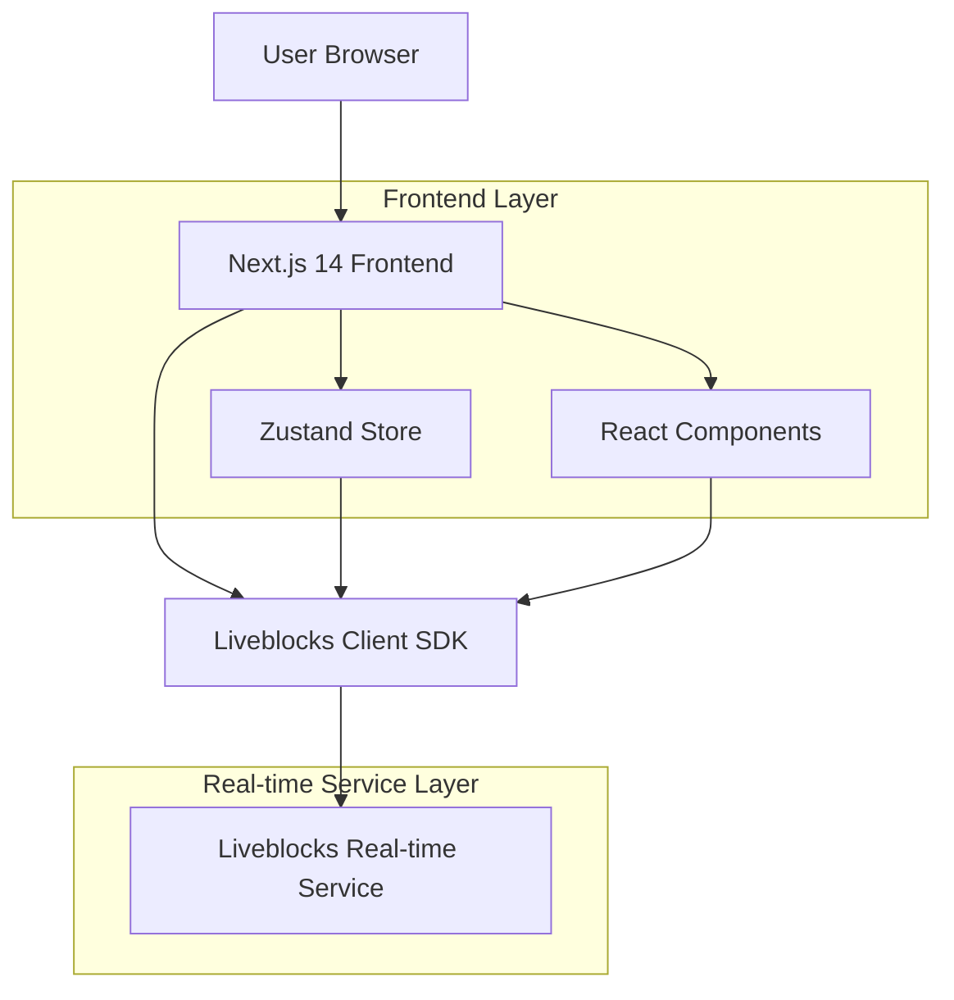

## 1. Architecture Design



## 2. Technology Description

* **Frontend**: Next.js 14 + React 19 + TypeScript

* **Real-time Collaboration**: Liveblocks (Client SDK)

* **State Management**: Zustand 5.x

* **Styling**: Tailwind CSS 4.x

* **Icons**: Lucide React

* **Image Processing**: html-to-image

* **Build Tool**: Next.js built-in (Webpack/Turbopack)

* **Backend**: None (Liveblocks handles real-time backend)

## 3. Route Definitions

| Route | Purpose                                               |
| ----- | ----------------------------------------------------- |
| /     | Main canvas page - collaborative whiteboard interface |

## 4. Core Components Architecture

### 4.1 Main Components

**Canvas.tsx** - Central component containing:

* Drawing tools and shape creation

* Real-time cursor tracking

* Element selection and manipulation

* Layer management (bringToFront, sendToBack)

* Chat system integration

* Export functionality

**Cursor.tsx** - User presence visualization

* Displays other users' cursor positions

* Color-coded user identification

**Toolbar.tsx** - Tool selection interface

* Tool buttons with keyboard shortcuts

* Color picker

* Undo/redo controls

### 4.2 State Management

**Zustand Store (useStore.ts)**:

* Local UI state management

* Tool selection

* Camera position and zoom

* User preferences

**Liveblocks Storage**:

* `elements: LiveList` - All canvas elements

* `messages: LiveList` - Chat messages

* `presence: cursor position` - Real-time user presence

## 5. Data Model

### 5.1 Element Types

```typescript
interface Layer {
  id: string;
  type: 'rectangle' | 'circle' | 'text' | 'note' | 'image' | 'pencil';
  x: number;
  y: number;
  width: number;
  height: number;
  fill?: string;
  stroke?: string;
  content?: string;
  points?: number[][]; // For pencil drawings
}
```

### 5.2 Message Structure

```typescript
interface Message {
  user: string;
  text: string;
  color: string;
}
```

### 5.3 Presence Data

```typescript
type Presence = {
  cursor: { x: number; y: number } | null;
  selection: string[];
}
```

## 6. Real-time Operations

### 6.1 Element Mutations

* **addElement**: Creates new shapes/drawings

* **updateElement**: Modifies existing elements

* **deleteElement**: Removes elements by ID

* **bringToFront/sendToBack**: Z-order management using custom index finder

### 6.2 Collaboration Features

* **Live Cursors**: Real-time cursor position broadcasting

* **Simultaneous Editing**: Multiple users can edit different elements

* **Conflict Resolution**: Liveblocks handles operational transforms

## 7. Performance Optimizations

### 7.1 Drawing Optimizations

* Pencil tool uses 5px movement threshold

* Integer rounding for coordinate precision

* Path compression for smooth curves

### 7.2 Image Handling

* Aggressive compression (300px max dimension)

* JPEG format with 0.3 quality setting

* Base64 data URL storage

### 7.3 Rendering Optimizations

* React key optimization using element IDs

* Conditional rendering based on tool state

* Efficient Liveblocks proxy handling with custom findIndexById function

## 8. Security Considerations

* Liveblocks public API key (development environment)

* No sensitive data storage in client

* Image sanitization through compression

* XSS prevention in text content

## 9. Future Enhancements

### 9.1 Additional Features

* User authentication system

* Room management and sharing

* Advanced drawing tools (arrows, lines)

* Template library

* Version history

* Export to multiple formats (SVG, PDF)

### 9.2 Technical Improvements

* Server-side rendering optimization

* WebGL acceleration for complex drawings

* Offline capability with sync

* Mobile app development

* Integration with cloud storage services

